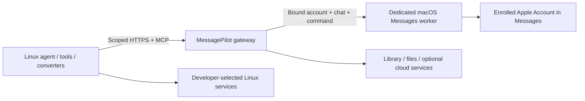

# Linux agent computers alongside macOS Messages

Apple's **Containerization** is a Swift package for running Linux containers in lightweight virtual machines on Apple silicon. The `container` CLI builds on it and consumes OCI images. The current project documents macOS 26 support; pin and inspect the release used in your deployment. Apple's newer Container machines direction adds persistent Linux development environments. [Containerization](https://github.com/apple/containerization), [container](https://github.com/apple/container), [Container machines presentation](https://developer.apple.com/videos/play/wwdc2026/389/).

The useful MessagePilot architecture is a Linux workload connected to an authenticated Mac worker:

Linux is a good home for agent runtimes, backend services, parsers, model tooling, browser automation and jobs that do not require Apple GUI frameworks. It cannot host Apple's Messages app, Apple Account Messages enrollment, Xcode or iOS Simulator. Having access to a Mac does not sign the container into that Mac's Apple Account. Native macOS capabilities remain on the separately bound Mac worker.

The repository's `apple/VM` app is a different option: a **macOS guest** through Virtualization.framework, with its own disk, hardware identity and limited shared directory. A macOS VM and a Linux container have different roles. Verify actual Messages/Apple Account availability in the chosen macOS guest rather than assuming virtual-machine creation proves account enrollment. The physical dedicated Mac remains an available native worker option.

## Implemented planning tool

MCP `bridge_container_plan` validates a container name, digest-pinned image, HTTPS gateway, account identifier and resource bounds. It returns an argv launch plan, no host mounts and a requirement to provision a scoped agent credential separately. It does not install Apple's tooling, start its service, pull images, launch a VM, sign into an Apple Account or grant Mac UI access.

Use existing dedicated-worker `computer.exec`/developer tooling only after the deployment explicitly selects and provisions its computer. A container's `localhost` is not the host gateway; configure a reachable TLS endpoint. Do not solve connectivity by exposing a personal Messages database or forwarding a raw phone-control service.

## Deployment design

- Keep the Mac identity resident and authenticated for low send latency. Do not start a new VM for every message.
- Use persistent containers/machines for stateful agent work and short-lived containers for isolated jobs, according to the pinned runtime's capabilities.
- Give each workspace/account its own agent grants, secret material, volumes and lifecycle. A workload may control only its assigned Mac session via a lease.
- Mount only designated artifact directories if needed; default plan mounts none. Never mount the host Keychain, Apple Account session, Messages database or home directory into an agent container.
- Return large outputs through the authenticated file/library API. Convert final results into prepared cards or attachments before entering the native send path.
- Keep provider tokens out of image layers, CLI plans and logs. Inject/revoke credentials through the developer's chosen secret mechanism.
- Route outage/uncertain send states explicitly; do not silently switch to the main AI's Apple identity or retry a potentially delivered message.

## Current evidence

Research and validated launch-plan construction only. The `container` CLI was not found on this development host; no installation, image pull, container launch or Messages-through-container acceptance occurred. The current file converter uses a restricted macOS process, not a Linux container. A containerized converter/provider is a useful next integration with the same file contract, not something this document claims is deployed.
