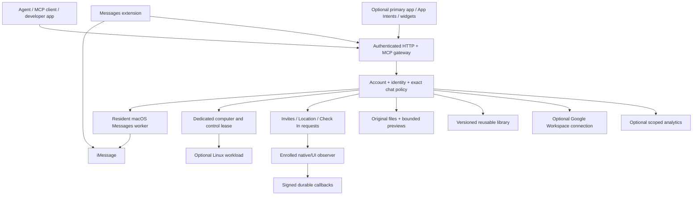

# MessagePilot developer guide

MessagePilot is an agent-operated bridge between enrolled Apple messaging identities, dedicated computers, iMessage extensions, optional primary apps and developer-selected tools/storage. It is not a replacement iMessage network, an Apple identity minting service or a promise that every Apple feature has a public API.

This document is the navigation point for the project. Update this index, the relevant feature guide, and acceptance evidence whenever behavior changes. Keep **implemented**, **compiled**, **fixture-tested**, **native-observed**, **bridge-proven**, **blocked** and **proposed** distinct.

## Architecture

The Mac identity handles Apple messaging; the agent runtime can run elsewhere. An active extension supplies rich interactive UI. The optional primary app gives access to capabilities that cannot live entirely inside an extension. The backend library can be local or developer-hosted. None of these surfaces silently inherit each other's identity or permissions.

## Code organization

The codebase is separated by responsibility: `src/` contains the gateway, persistence, worker and feature services; `native/` holds macOS adapters; `apple/` contains the app, Messages extension, widgets and virtual Mac; `tests/`, `scripts/` and `docs/` hold verification, tooling and contracts. Feature state remains bound to accounts and chats.

`src/progress/` groups its schema, persistent dispatcher, HTTP routes and MCP registration. Gateway command validation is shared by direct requests and progress dispatch. This is a coherent structure, but `gateway.ts` and `mcp.ts` still aggregate many older feature routes/tools and are the main refactoring targets as the project grows. Prefer extracting a feature module when changing it instead of expanding those files indefinitely. Do not confuse the directory layout with production or device acceptance.

## Start and operate

1. Follow the repository [README](../README.md) for build/configuration and agent/worker credentials.
2. Enroll the correct Apple identity in its dedicated Mac environment. Pair account-bound workers and exact chat grants before messaging.
3. Use [Chat scopes](CHAT_SCOPES.md), [Agent interface](AGENT_INTERFACE.md) and [Authentication](AUTHENTICATION.md) for permissions, idempotency, uncertain outcomes and credential boundaries.
4. Inspect [Capabilities](CAPABILITIES.md) and the acceptance reports for the specific operation/OS/device you intend to use.
5. Enable optional storage, Workspace, webhook and analytics policies explicitly. Keep secrets out of configuration committed to Git.

## Feature documentation

| Area                            | Guide                                                                                                                                                                   | Current scope                                                                                                                                                             |
| ------------------------------- | ----------------------------------------------------------------------------------------------------------------------------------------------------------------------- | ------------------------------------------------------------------------------------------------------------------------------------------------------------------------- |
| Background tasks                | [Progress messages](PROGRESS.md), [Developer behaviors](DEVELOPER_BEHAVIORS.md)                                                                                         | Persistent scoped progress, bounded native edits, final attachments and a polling extension view; fixture-tested and simulator-compiled.                                  |
| Native rich messaging           | [Rich messaging verification](RICH_MESSAGING_VERIFICATION.md), [Expanded acceptance](EXPANDED_ACCEPTANCE.md), [Physical phone acceptance](PHYSICAL_PHONE_ACCEPTANCE.md) | Detailed existing test results and remaining native limitations.                                                                                                          |
| iMessage apps                   | [App catalog/workflows](IMESSAGE_APPS.md), [Messages framework](MESSAGES_FRAMEWORK.md)                                                                                  | Public content families, live/template layouts, stickers, staging/direct sends, sessions and bounded backend-free state codec. Not arbitrary access to all built-in apps. |
| Apple development               | [Apple development](APPLE_DEVELOPMENT.md), [Primary app port](PRIMARY_APP_PORT.md), [App Intents](APP_INTENTS.md)                                                       | Build tools, optional host, widgets/Live Activities, authentication, capture and typed automation actions.                                                                |
| Files                           | [Files](FILES.md), [Format acceptance](FILE_ACCEPTANCE.json)                                                                                                            | Arbitrary original storage/download; format-specific read/display with explicit converter/native limits.                                                                  |
| Reusable backend                | [Backend library](BACKEND_LIBRARY.md)                                                                                                                                   | Local SQLite immutable assets and generic developer-hosted HTTP provider contract; vendor-specific blob adapters remain extension points.                                 |
| Google Workspace                | [Workspace bridge](GOOGLE_WORKSPACE.md)                                                                                                                                 | Granted fixed API routes, developer OAuth and refresh; fixture-tested, no live account connected.                                                                         |
| Optional analytics              | [Analytics](ANALYTICS.md)                                                                                                                                               | Scoped observations, command telemetry, counts, explicit-receipt timing and bounded context; complete native collection is not automatic.                                 |
| Extension webhooks              | [Invites, Location and Check In](EXTENSION_WEBHOOKS.md)                                                                                                                 | Durable agent-mediated queues, exclusive claims, labeled observations and HMAC callbacks; controlled physical-phone outcomes recorded.                                    |
| MCP and computer control        | [MCP and computer](MCP_AND_COMPUTER.md)                                                                                                                                 | Official Registry discovery, explicitly configured MCP connections, lease-based takeover.                                                                                 |
| Linux on Mac                    | [Containerization](CONTAINERIZATION.md)                                                                                                                                 | Researched architecture and validated launch-plan tool; no container runtime installed/launched.                                                                          |
| Representative contacts / voice | [Lines and FaceTime](LINES_AND_FACETIME.md)                                                                                                                             | Identity/delegation proposal and official API research; no line provisioning or FaceTime duplex engine implemented.                                                       |
| Verification                    | [Verification](VERIFICATION.md)                                                                                                                                         | How to interpret source, fixture, simulator and native evidence.                                                                                                          |

## Design choices for developers

- **Identity:** a branch can use a separate real enrolled representative identity. Renaming an agent does not create a new iMessage sender. Do not fall back to the main line when a branch is unavailable.
- **Speed:** keep workers/connections resident, prepare rich payloads and media ahead of time, use recent-user-interaction direct sends where permitted, cache previews, and keep model/conversion work outside the native send interaction.
- **State:** compact turn-based state can travel in the message URL without a backend; shared authoritative state, large files and external tools usually belong in the optional library/backend.
- **Authentication:** native Messages sign-in supplies the Apple transport identity, not arbitrary backend authorization. Gateway credentials, participant policy, passkeys and Google OAuth remain separate.
- **Observability:** record evidence and source, distinguish requested/started/delivered/read/unknown, and never manufacture success from a queue receipt.
- **Privacy:** exact-chat policy applies to files, library, hooks and optional analytics. Rich UI participant UUIDs do not automatically map to a gateway chat ID.

## Maintenance contract

For every change, document configuration, permissions, supported inputs, outputs/state semantics, limits, failure/recovery behavior, examples and verification level. Add meaningful tests for authorization, replay/idempotency, concurrency, parser boundaries and real integration contracts. Keep synthetic evidence shareable and raw personal device evidence excluded. Do not replace a blocked entry with “supported” solely because a route or schema now exists.
