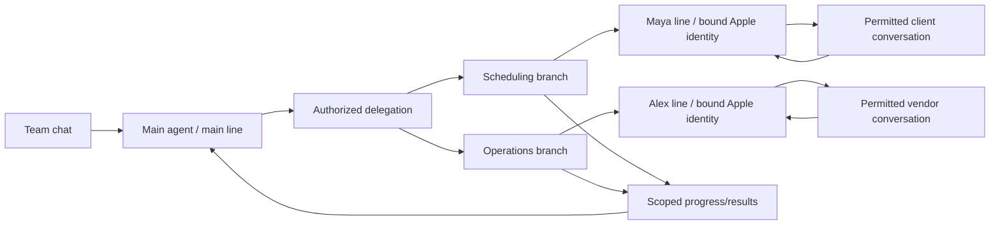

# Representative lines and FaceTime Audio — research and proposed architecture

Research date: 2026-10-07. **This is a design proposal, not implemented line provisioning or verified FaceTime media support.** No FaceTime call or message to another person was placed during this investigation.

## A line is an identity; a branch is delegated work

The main agent can remain the team's familiar contact while representatives contact outside people under distinct identities. Keep four entities separate:

| Entity       | Responsibility                                                                                         |
| ------------ | ------------------------------------------------------------------------------------------------------ |
| Agent        | Reasoning, tools and behavior; may serve one or several permitted lines                                |
| Line         | Stable public contact identity, channel bindings, credentials, worker session and authorization policy |
| Branch       | A delegated role/task, parent relationship, allowed contacts, selected context, tools and expiry       |
| Conversation | Exact line + native chat identity + participants + transport; owns its history and reply routing       |

A branch does not always require a new line: a developer can reuse a team's established scheduling representative across delegated tasks. Conversely, two representatives that must appear as different iMessage contacts need genuinely different reachable sender identities. Changing a prompt, display name or vCard does not create a new Apple messaging identity.



Example: a team member messages the main agent, “Have Maya arrange a viewing with this contact.” The orchestrator creates a delegation with that recipient and task, allocates Maya's already enrolled line, and grants the branch only the relevant scheduling context. The external message comes from Maya's line: “I'm Maya, the team's AI scheduling assistant.” Replies return to that line and branch. The main team chat receives progress or requested escalation. Internal team history is not copied wholesale into the external conversation.

Developers should be able to choose persistent representatives, per-customer branches, per-task branches, many branches sharing an explicit representative line, or separate lines for strict separation. Parent-child hierarchy governs delegation; it must not automatically grant every child the parent's contacts, message history, tools or credentials.

## Apple identity and contact provisioning

Apple documents choosing a registered phone number or Apple Account address for Messages and FaceTime. Registering a phone number requires an active SIM/eSIM. A generic purchased phone number or a generated line record is not proof of iMessage/FaceTime activation. [Apple sender setup](https://support.apple.com/en-gb/108758).

Recommended isolation: bind each independently presented Apple line to an enrolled Apple Account and dedicated signed-in worker session/device. Reuse a verified identity only where the developer deliberately wants the same public contact. Do not treat multiple reachable addresses on one shared account as independent security boundaries; they share an account and message environment. Apple explicitly notes conversation visibility risks from sharing accounts. Provisioning, activation and recovery are separate enrollment steps; no public general-purpose Apple identity-minting API was found.

A developer-facing `lines.create` should therefore create a logical line in `awaiting_identity`, or allocate from an already enrolled pool. It must not claim to provision an Apple Account or eSIM. An external provisioning adapter may manage an appropriate carrier or owned VoIP service, but Apple activation remains an independent acceptance gate.

Representatives can offer a contact card using Apple's [vCard serialization](https://developer.apple.com/documentation/contacts/cncontactvcardserialization) from developer-supplied data. This does not require reading the user's contact book. Names/photos are presentation metadata: recipients still receive the actual sending address/number, and their saved contact naming can differ. [Messages identity disclosure](https://www.apple.com/legal/privacy/data/en/messages/).

## Proposed developer endpoints

These endpoints are proposed; they do not exist in the current gateway.

| Endpoint / equivalent MCP tool                           | Contract                                                                                                                    |
| -------------------------------------------------------- | --------------------------------------------------------------------------------------------------------------------------- |
| `POST /v1/workspaces/{workspace}/lines` / `lines_create` | Create a logical line or reserve an enrolled pool identity; return provisioning state and capabilities                      |
| `POST /lines/{line}/binding` / `lines_bind`              | Bind a verified transport account + worker generation + sender address; operator-only enrollment                            |
| `GET /lines/{line}/capabilities`                         | Report channel-specific compiled, configured and device-tested status                                                       |
| `POST /branches` / `branches_create`                     | Set parent, role, policy, context grants, contacts, tools and optional line                                                 |
| `POST /delegations` / `delegations_create`               | Authorized task with explicit representative line, recipient/contact set, purpose and idempotency key                       |
| `POST /lines/{line}/messages` / `lines_send`             | Resolve the line binding server-side and dispatch through the existing command queue; caller cannot override sender/account |
| `GET /lines/{line}/conversations/{conversation}`         | Read only that line/conversation's allowed history                                                                          |
| `GET /lines/{line}/contact-card`                         | Export public identity/role data as a contact card; no hidden credential or private profile export                          |
| `POST /lines/{line}/calls` / `lines_call`                | Request a channel-specific call with an explicit recipient and capability check; a launch is not a connection               |
| `POST /calls/{call}/handoff`                             | Transfer agent/human control of the existing session; changing caller identity may require a new call                       |
| `POST /lines/{line}/revoke`                              | Revoke outbound authority, drain uncertain work and preserve routing/audit tombstones                                       |

Example delegation payload:

```json
{
  "parentAgentId": "team-main",
  "branchRole": "scheduling",
  "lineId": "maya-scheduling",
  "recipientContactIds": ["authorized-client"],
  "task": "Arrange the requested viewing",
  "contextGrants": ["listing-summary", "viewing-availability"],
  "tools": ["messages.send", "messages.list", "calendar.availability"],
  "idempotencyKey": "viewing-request-001"
}
```

Required routing chain: authenticated principal → workspace → delegation → line binding → verified worker/session → permitted recipient/native chat. Incoming replies route from authenticated worker + its bound account + native chat, never from the sender number alone or the workspace currently visible in a UI. Keep bindings versioned; reject stale worker generations. Never silently send from the main line when a representative line is offline. Do not recycle a public address into another workspace: delayed replies must not expose old conversations to new owners.

External recipients' messages are conversation data, not authority to create branches, change line bindings or broaden contact access. Authenticate the team member and evaluate delegation policy before acting on a team-chat request.

Scope the webhook configuration to line and delegation in a future extension, while preserving today's fixed account/chat binding. Useful events include `delegation.created`, `line.enrollment_required`, `message.delivered`, `reply.received`, `handoff.requested` and `delegation.completed`. Emit delivery/call status only from actual transport evidence. Parent summaries should be deliberately scoped, and human takeover should use the same exclusive-control mechanism as agent execution.

## FaceTime Audio: what Apple exposes

| Capability                                        | Current evidence                                                                                  | Meaning for MessagePilot                                                                                                                                                                                                                                                                                                  |
| ------------------------------------------------- | ------------------------------------------------------------------------------------------------- | ------------------------------------------------------------------------------------------------------------------------------------------------------------------------------------------------------------------------------------------------------------------------------------------------------------------------- |
| Launch an addressed call                          | Apple's archived URL-scheme reference documents `facetime-audio:` with a number/email on iOS      | Candidate launch adapter; verify present OS prompts, app availability and recipient on-device. It is not a REST call-control service. [Apple reference](https://developer.apple.com/library/archive/featuredarticles/iPhoneURLScheme_Reference/FacetimeLinks/FacetimeLinks.html)                                          |
| Choose caller identity                            | FaceTime settings select a reachable number/email and outgoing Caller ID                          | Bind to an enrolled line; do not supply an arbitrary per-call `from` address. [FaceTime setup](https://support.apple.com/en-il/guide/iphone/iph40976f340/ios)                                                                                                                                                             |
| Add synthesized speech to an active FaceTime call | Apple's iOS 18.2+ AAC sample documents microphone injection, system opt-in and per-app permission | A promising **outbound audio** path through the optional primary app. This is documented as an accessibility/AAC feature, not a general FaceTime bot SDK. [Apple speech sample](https://developer.apple.com/documentation/avfaudio/adding-synthesized-speech-to-calls)                                                    |
| Read the remote participant's audio on iPhone     | No general public remote-FaceTime-audio stream was established by this research                   | The injection API alone cannot provide two-way AI conversation; receiving audio remains a blocker to prove                                                                                                                                                                                                                |
| Capture selected process output on Mac            | Core Audio process taps are public APIs with audio-recording permission                           | Candidate receive path, **not verified for FaceTime**; exclusions/routing must be tested. [Apple process-tap sample](https://developer.apple.com/documentation/coreaudio/capturing-system-audio-with-core-audio-taps)                                                                                                     |
| Native call UI for a developer-owned VoIP service | CallKit integrates the app's own VoIP backend; default-calling support is separately documented   | Supports an owned voice channel under the same line abstraction. It does not grant ownership of Apple's FaceTime signaling/media. [CallKit](https://developer.apple.com/documentation/callkit), [default calling app](https://developer.apple.com/documentation/callkit/preparing-your-app-to-be-the-default-calling-app) |

For the iPhone speech path, the primary app would check `AVAudioApplication.shared.microphoneInjectionPermission`, provide `NSMicrophoneInjectionUsageDescription`, request permission, and prefer `.spokenAudio` via `setPreferredMicrophoneInjectionMode`. The person must enable Add Audio in Calls in Accessibility settings and grant the app permission. Listen for injection-availability changes and stop on revocation/end. That signal is not proof of a particular recipient or a full-duplex media connection.

The most useful investigation is two separate audio adapters behind a common call session:

1. **FaceTime experiment:** a dedicated Apple worker with explicit call-launch/UI verification, chosen input/output devices, and a separately proven receive/send audio route. On iPhone, test speech injection in the signed primary app. On Mac, investigate authorized process output capture and a provisioned virtual input route. Do not advertise either as a completed full-duplex FaceTime integration.
2. **Owned VoIP channel:** the companion app owns WebRTC/VoIP media, uses CallKit for system integration and connects to a realtime voice model. This provides controllable media and signaling, but calls are not FaceTime calls. Keep the channel visible in capabilities and developer choices.

Both adapters would use a provider-neutral realtime audio session with streamed input/output, interruption cancellation, echo control, bounded buffering, human takeover and an explicit capture/transcription policy. Preserve the line's sender identity across text and voice when the native platform supports it. Run call media in the primary app/native worker, not the short-lived Messages extension. Expose `requested`, `launching`, `ringing`, `connected`, `ended`, `failed` and `outcome_unknown` only where the adapter has evidence for those transitions.

## Acceptance gates and fit

Before claiming FaceTime support, prove an authorized two-device call, exact caller identity, audible generated speech at the receiving device, a usable incoming audio stream, interruption behavior, disconnect/lock/background recovery and cleanup. No calls were placed in this session, no call audio captured, and no audio settings changed.

Before claiming representative lines, verify two separately enrolled identities, external recipient appearance, replies routed to the correct branch after restart, cross-line denial, human takeover and no main-line fallback. The current worker's configured identity string is not sufficient independent proof of Apple's actual sender identity.

Apple's Messages privacy page describes iMessage as a personal communication service and notes restrictions on commercial/unwanted use. A scalable commercial representative product needs a supported-channel strategy and explicit platform-fit review; a flexible transport interface lets developers select an appropriate business messaging or owned voice channel without redesigning the delegation model. [Apple's published service description](https://www.apple.com/legal/privacy/data/en/messages/).
